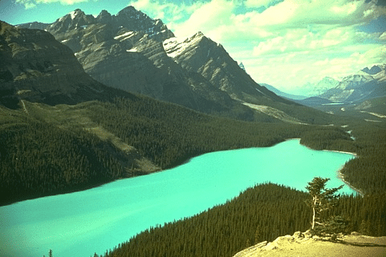
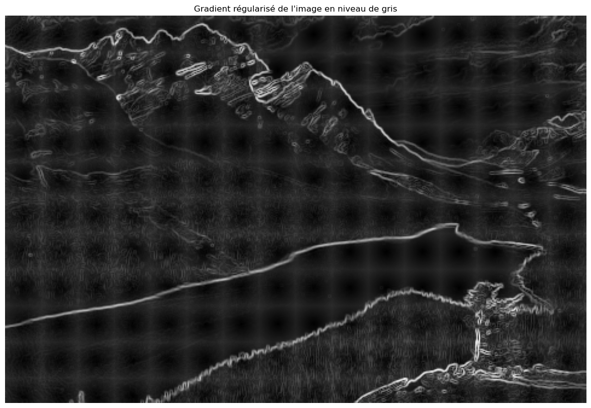
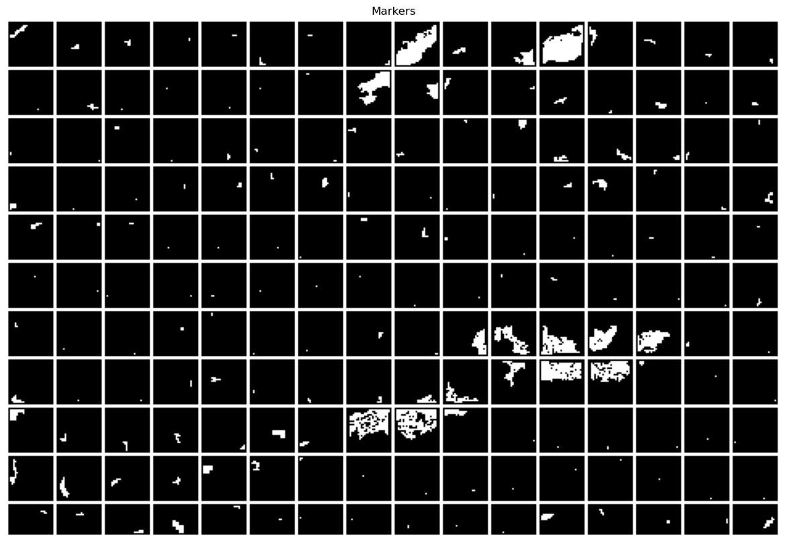
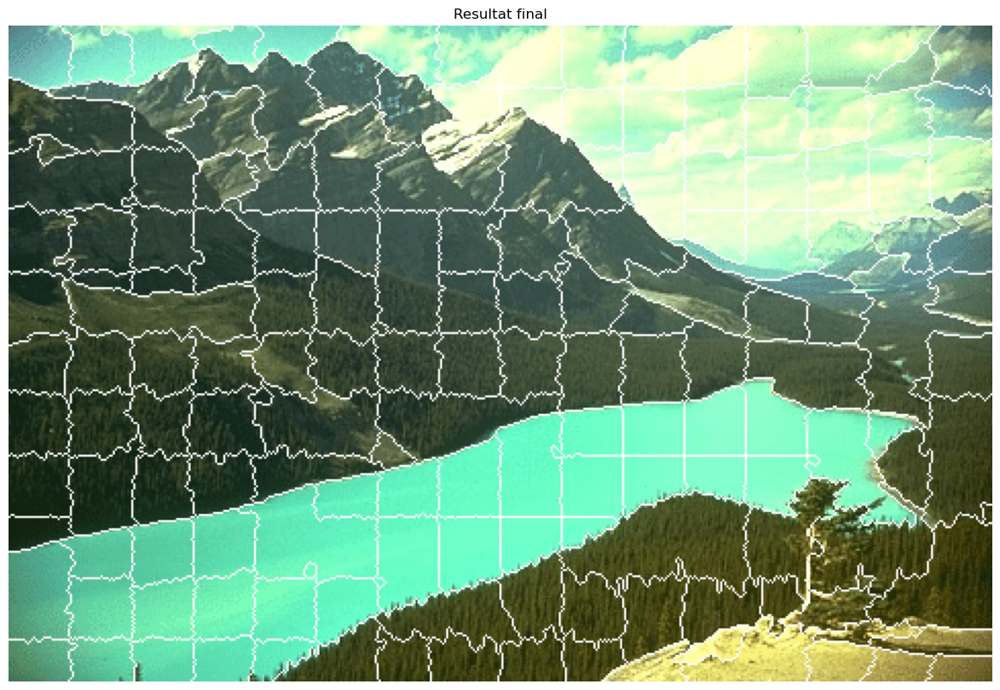
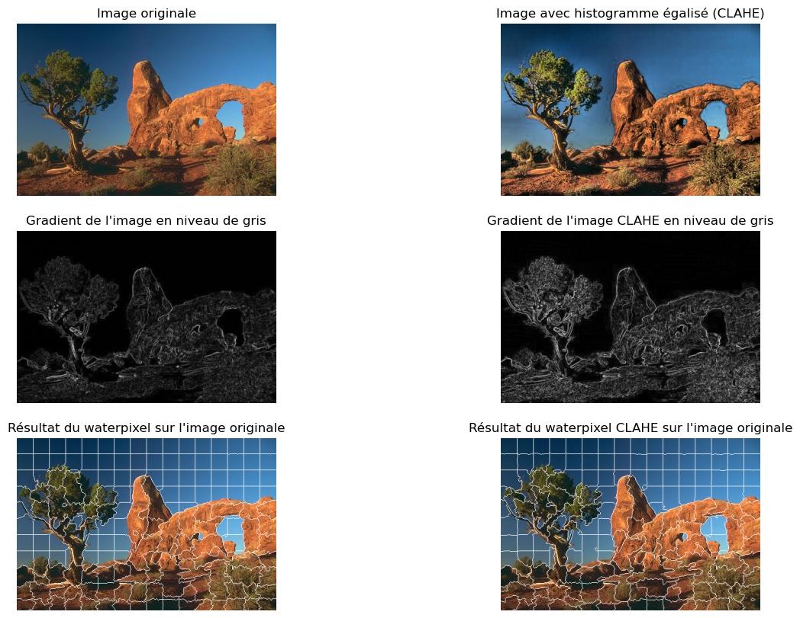
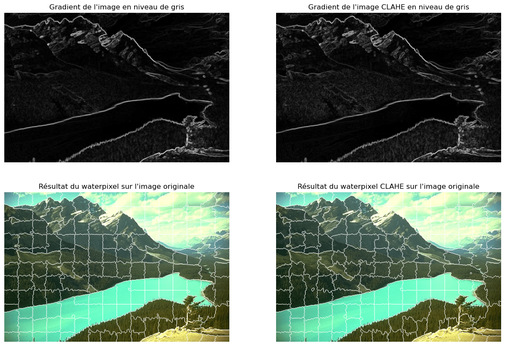
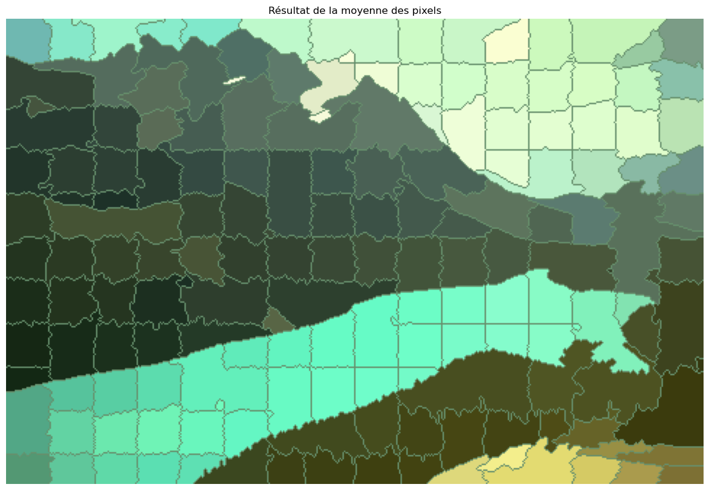
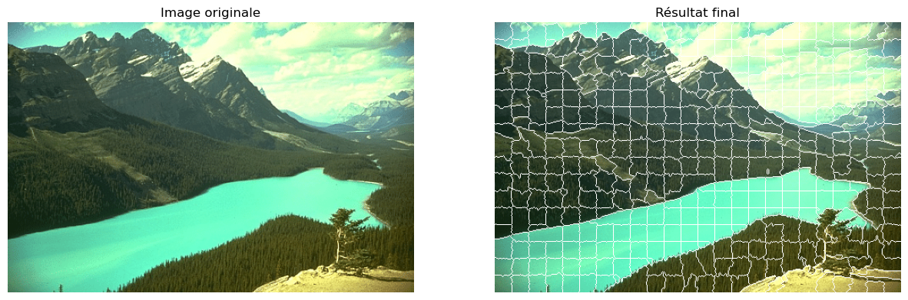
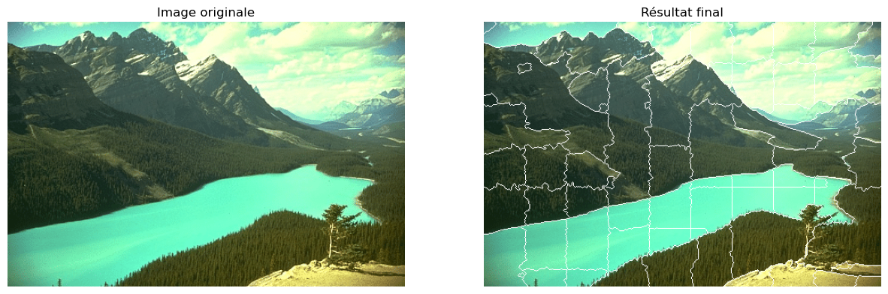

# Morphologie mathématique - M2 I3D / CMI IIRVIJ

## WATERPIXELS : SUPERPIXELS BASED ON THE WATERSHED TRANSFORMATION Par Enzo BORMANN et Evan DUBOIS

### Introduction

Pour ce projet, nous avons décidé d'implémenter l'algorithme présenté dans l'article *WATERPIXELS : SUPERPIXELS BASED ON THE WATERSHED TRANSFORMATION*. Vous trouverez notre réalisation dans le fichier `waterpixel.py`. 

Pour l'utiliser, il suffit de lancer la commande `python3 waterpixel.py <image_source> -st <value> -so <value> -k <value>`. Les paramètres sont respectivement le chemin vers l'image, la taille des carreaux de la grille, l'épaisseur du contour de celle-ci ainsi que la paramètre de régularisation spatiale du gradient. Attention cependant à ne pas utiliser des images trop volumineuses, c'est pourquoi nous vous proposons une banque d'image directement dans le dossier `/images`. A titre d'exemple, nous avons utilisé l'image `waterpixel.png` : 



### Implémentation

Pour implémenter l’algorithme nous avons commencé par la fonction `generate_waterpixels(image_path)` prenant en paramètre le chemin de l'image à traiter. Les étapes se poursuivent ainsi :

- Conversion en niveau de gris pour en calculer le gradient. A partir de ce gradient, nous calculons le gradient régularisé comme donné dans l'article. Nous avons codé la fonction `regulized_gradient(image, k = k_regulized_gradient, sigma = 50)`. Une fois les deux images gradient générées, nous les convertissons les images à valeurs flottantes en valeur entières. Cette conversion nous permettra d'utiliser par la suite la fonction watershed qui ne traite, justement, que les entiers. 



- Appel à la fonction `generate_marker(img)`, implémentée par nos soins et prenant en paramètre le gradient de l'image précédemment générée. 

  - Cette fonction, découpe l'image gradient en carreaux de taille `size_tile` (défini en paramètre de programme) et appel la fonction `min_local_tab(tab)` pour chacun d'eux. Cette nouvelle fonction retourne un marqueur, comme défini dans l'article, pour le carreau donné en paramètre. Ce marqueur est placé dans une nouvelle image qui contiendra tous les autres marqueurs. De la même manière que précédemment, nous convertissons les flottants en entiers.

  - La fonction `min_local_tab(tab)` a été implémentée comme suit :

    ```pseudocode
    parcours des pixels de l'image :
    	si la valeur du pixel est plus petite que les autres deja rencontre
    		calcul et sauvegarde du marqueur correspondant
    		calcul de la taille de sa composante connexe
    		sauvegarde de la taille et de la valeur
    	si la valeur du pixel est identique au minimum deja trouve
    		calcul du marqueur correspondant
    		calcul de la taille de sa composante connexe
            si cette taille est plus grande
            	remplace le marqueur par le nouveau marqueur
            	remplace la taille par la nouvelle taille
    ```

  - On utilise également la fonction `connectedComponent(tab, indice_I, indice_J, tabToReturn, val, tab_mark)` qui permet de calculer la taille d'une composante connexe et qui fonctionne comme suit :

    ```pseudocode
    si le pixel a deja ete parcouru 
    	sortie
    on marque le pixel comme deja parcouru
    si le pixel n'a pas la meme valeur que celle recherchee
    	sortie
    sinon
    	on allume le pixel (appartient au marqueur)
    On se propage sur les 4 voisins (gauche, haut, droite, bas) en s'assurant de ne pas sortir du tableau et de ne pas revisiter un pixel
    On renvoi le tableau des marqueurs
    ```



- Nous convertissons nos marqueurs précédemment relevés en label via la fonction `marker_label = measure.label(marker_int)` afin d'appeler la méthode `watershed()` de scikit-image.



La suite du code concerne simplement l'affichage des différents résultats. 
D'autres fonctions utilitaires ont été implémentées :
- `generate_grid(img, color, modify, grid_epaisseur = size_outline)` permettant de générer une grille de carreaux de taille `size_tile` et d'épaisseur `grid_epaisseur`.
- `superpose_watershed_line(img1, img2)` permettant d'ajouter les pixels noirs de `img1` en pixels blancs dans l'image `img2`.
- `superpose_marker_grid(img1, img2)` permettant de supperposer les markers sur la grille afin de voir l'espace entre les markers et le bord des carreaux.
- `get_cell_center_distance(x, y)` permettant de calculer la distance entre un pixel et le centre d'un carreau de la grille.

### Pour aller plus loin

Nous avons également décidé d'aller plus loin que l'article en implémentant notamment les deux méthodes suivantes : 

#### Égalisation d'histogramme

Dans un premier temps, nous avons voulu améliorer les résultats. Pour ce faire, l'un des points faibles du modèle précédent était le résultat de l'image gradient. En effet, dans le cas des images pas assez contrastées, il manquait des informations importantes dans certaines zones de l'image. De ce fait, nous avons tester différentes méthodes afin d'améliorer ce point. Celle apportant les meilleurs résultats fut l'égalisation d'histogramme par la méthode CLAHE. Voici les différences obtenues :



Nous remarquons une certaine amélioration dans l'image résultante. En effet, nous pouvons voir que les coutours des objets sont mieux délimités dans cette image d'exemple. Cependant, nous remarquons tout de même quelques artefact comme de nouvelle mini-cellule qui apparaissent et qui ne suivent plus la grille.

Par contre, nous avons pu observer que cette implémentation ne servait que sur les images qui ne sont pas très contrasté. Nous pouvons l'exemple de l'image `waterpixel.png` où les différences sont beaucoup moins visible car le gradient de l'image est proche dans les 2 cas.



#### "Segmentation" de l'image

Dans un second temps, nous avons voulu créer une sorte de segmentation de l'image à partir de la subdivision proposé par le watershed. Pour Ce faire, nous avons créé la fonction`get_mean_color(image, watershed_image)` permettant, à partir de `watershed_image` et de l'image original, de calculer la moyenne des couleurs pour chacune des subdivisions et d'en sortir l'image suivante :



Ce résultat peut notamment servir dans le cas d'une segmentation d'image. Cela peut également nous donner des informations sur les couleurs princpales dans certaines zones.

## Resultats

Nous avons commencé par tester différents paramètres pour une même image. Nous avons fait évolué les différents paramètres en laissant les autres paramètres par défaut. Ces derniers sont les suivants : st = 30, so = 5, k = 4.

Pour le paramètre k :
- k = 0


- k = 4


- k = 10


Pour le paramètre st :
- st = 20


- st = 30


- st = 40


- st = 50


Pour le paramètre so :
- so = 5


- so = 10


- so = 15


- so = 20


Pour ne pas surcharger le rapport, nous avons effectué des tests sur une banque d'image que vous retrouverez dans le dossier `imagesTest`. C'est à partir de ces images, tout en utilisant les paramètres par défaut, que nous avons pu obtenir de tel résultat.

De ces résultats, nous remarquons que le contraste a une importance captiale dans les performance du Waterpixel. En effet, certaines images peu contrastées ou avec une faible profondeur de champ sont moins bien délimitées. Dans ce cas, l'application de l'égalisation d'histogramme via la méthode la méthode CLAHE semble compenser cette perte. Nous pouvons voir cela dans l'`image13.png` avec le chat qui a un arrière plan très flou et qui est mal délimité sans l'utilisation de CLAHE.

Il semblerait également que la méthode du Waterpixel soit plus efficace sur des matières organiques plutôt que sur des formes géométriques. L'`image9.png` comportant les briques, étant un peu bruité, ne propose pas un résultats convaincant. Nous pouvons voir à cela une exception concernant l'`image14.png` qui, dû au fort contraste local des lignes, bleu sur blanc, propose d'étonnement bons résultats. 
